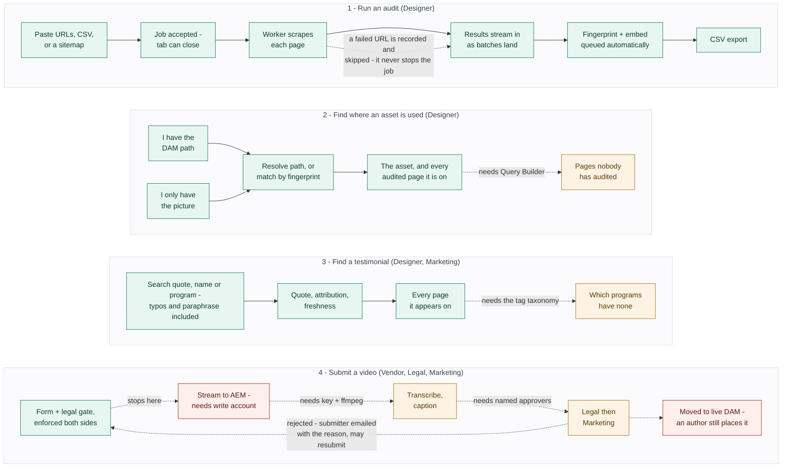

# SEI Site Auditor — capability assessment

Every path a person can take through the tool, and exactly where each one stops.
**Fourteen capabilities work today** against the live site with no credentials at
all. The rest are waiting on someone — and it is worth knowing who.

| | |
|---|---|
| **Built to** | PRD v1.5 |
| **Verified** | against live capella.edu |
| **Tests** | 218 passing, 13 suites |
| **AEM access** | none yet |

| | Count |
|---|---|
| Work today, end to end, with no AEM account and no API keys | **14** |
| Built and waiting on a credential, a service, or a config someone must provide | **12** |
| Blocked on a human decision, not a technical dependency | **6** |

---

## Where each path runs out

Four distinct jobs bring someone here. Three of them complete today. The fourth —
video intake — cannot start, because its very first step writes to AEM.

**Key** — 🟩 works today · 🟨 needs a credential or service · 🟥 hard stop without AEM write access

Three of the four journeys complete end to end today with no AEM account at all.
Video intake stops at its second step, because uploading to the staging folder is
the first thing it does.

> Every step drawn amber or red already exists in code and is covered by tests.
> None of them has run against a real AEM instance. A blocked feature returns a
> structured `501` explaining what is missing — it never fails silently or crashes.

---

## Works today

Verified by running it — real audits against live capella.edu pages, not a unit
test. None of this needs an AEM account, an API key, or anything from IT.

| Capability | How it was verified |
|---|---|
| Bulk URL audit — paste, CSV, or sitemap | Ran real capella.edu pages end to end; sitemap indexes followed one level |
| Background job queue, resumable | Work unit is a DB row, so a crash resumes from what is still pending |
| Live progress and streaming results | Polled every 3s; rows appeared as batches landed |
| One bad URL never stops a job | A deliberate 404 was recorded and skipped; the others completed |
| Asset search and browse | 72 real assets across 10 audited pages and 8 DAM brand folders |
| Reverse lookup by DAM path | Path, public URL and rendition URL all resolve to one asset |
| Reverse image search | Resize scored 0, WebP 0, JPEG q60 scored 2; unrelated image no match |
| Image fingerprint index | **655 of 655 fingerprintable images** hashed over public HTTP. 665 images are indexed; the other ten are classified and named, not left as a gap — capella.edu 403s eight, one path returns a web page instead of the file, one is a 1×1 transparent spacer. Each is retried after 14 days in case the site changes |
| Duplicate detection | Runs ungated; found one real duplicate pair and reports coverage alongside it |
| Testimonial scrape, search, page map | Extracted real testimonials with attribution and degree level |
| **The index keeps itself current** | A completed audit queues the fingerprint and embedding sweeps itself. Verified unattended on two fresh pages: hashing 56/58 → 62/64, embeddings 65/65 → 72/72 |
| Search that survives typos and paraphrase | `Wbeb` finds Webb; "balancing work and study" finds the quote that never uses those words |
| CSV export — audits and testimonials | Both return 200 with well-formed, formula-escaped CSV |
| Published / Draft / Unknown status | Scraped heuristic; reports Unknown honestly rather than guessing |
| Link-rot check, every three days | All 779 assets re-checked: 770 served, 8 no longer served, **1 soft 404** — answers HTTP 200 with the site's own error page. A status-only check had filed that one as live |
| Start audits from the published site | The Audit page hands URLs to the GitHub Actions workflow and lists runs live from GitHub, with no backend. Two clicks with no setup — verified in the browser against the real run history. One click with a token: every branch of `api/run-audit.mjs` exercised against a mocked GitHub, **never against a real token** — none exists yet |

> **Duplicate detection is not a Phase 2 feature.** The PRD files it under Phase 2,
> behind the AEM service account. It does not need one — DAM assets are publicly
> served, so the fingerprint index is built over ordinary HTTP. Verified with every
> AEM flag off.
>
> It had been gated anyway, which would have withheld a working feature for months
> waiting on an account it never required. Reverse image search runs on the same index.

---

## Needs a hookup

All of this is written and tested. Each row needs one thing from one person.
Nothing here needs more design or more engineering first. Grouped by dependency,
because one account unlocks six rows at once.

| Capability | What it needs | Who provides it |
|---|---|---|
| Sitewide reverse lookup | `capella-dam-audit-svc` read-only over `/content/dam/`, plus a dispatcher rule allowing `/bin/querybuilder.json` | **IT** — unlocks 6 |
| Rich asset metadata — dimensions, tags, size | Same read-only account | IT |
| Authoritative publish status | Same account — reads `cq:lastReplicated` | IT |
| Unused-asset flagging | Same account | IT |
| Structured testimonial extraction | Same account | IT |
| Program coverage gaps | Same account **and** the program tag taxonomy | IT + Content |
| Video intake submission | `capella-dam-intake-svc` write account, scoped to two paths only, plus a dispatcher rule blocking `/content/dam/sei/capella/intake/` publicly | **IT** — blocks the lane |
| Move to live DAM on approval | Same write account | IT |
| Transcription and VTT captions | An OpenAI key, and ffmpeg installed on the worker host | Engineering / DevOps |
| Chapter markers | An Anthropic key. Optional — without it the transcript and captions still work | Engineering |
| Approver and submitter emails | An SMTP host, and the approver addresses | IT + Marketing |
| Approver sign-in | Currently a shared token. Needs the SSO decision | IT / Security |

See [`dam-permissions.md`](./dam-permissions.md) — written to hand to IT directly.

---

## Waiting on a decision

These are not engineering tasks. Each one is a question only a person can answer,
and the code already accommodates whichever answer comes back.

| Question | Where it stands | Owner |
|---|---|---|
| Sequential or parallel approval? | **Both are built.** One environment flag switches them; both are unit-tested | Legal + Marketing |
| Who are the named approvers? | One address each today. Per-person identity needs the SSO answer | Legal + Marketing |
| Is the agreement copy approved? | Verbatim from the PRD and **not yet reviewed**. Blocks launch, not development | Legal |
| Where do the full terms live? | Points at a placeholder URL the form links to in a new tab | Legal |
| How should assets be ranked by social performance? | **Deliberately unimplemented.** An invented formula would be worse than none | Marketing |
| What happens to rejected videos after 90 days? | Nothing. The tool has no delete permission by design, so retention must be an AEM workflow | Legal / DAM admin |

---

## Four things the PRD gets wrong

All four were discovered by pointing the scraper at the real site. Every one would
have shipped as a silent undercount — the worst kind of failure for an audit tool,
because a missing result is indistinguishable from a clean bill of health.

1. **The prescribed page-load wait never fires on capella.edu.** The spec says wait
   for the network to go quiet. The site holds analytics connections open
   indefinitely, so it never does — measured: still not quiet five seconds after the
   page finished loading. The first live audit failed **3 of 3 URLs** on timeout. It
   now waits for `load` instead, which returns in about 1.8 seconds with the full
   rendered page.

2. **The DAM root in the spec is the legacy one.** The spec scopes the tool to
   `/content/dam/capella/`. Capella's assets have been migrated into the shared SEI
   DAM, so most references are now `/content/dam/sei/capella/`, alongside `vc/` and
   sibling-brand chrome. Measured across three pages, the spec's path matched **14
   assets where the real DAM root matches 51** — roughly three quarters of every page
   was being discarded without a word.

3. **Assets are not only in attributes.** The spec lists `img[src]`, `srcset` and
   `a[href]`. Capella builds hero and footer banners as CSS `background-image`, and
   preloads images via `link[href]`. On the tuition-cap page that is **11 of 31
   references — including both images a person would actually name**. Extraction now
   also reads inline styles and computed backgrounds.

4. **None of the five testimonial selectors match anything on the site.** Capella
   uses `.testimonialPromo` and `.testimonial-promo`; the spec's `.testimonial` is an
   exact class match and hits neither. The attribution has no dash either — one
   element holds the quote, the name, the degree and a legal disclaimer all together.
   Before the fix the tool reported **zero testimonials sitewide**, silently.

> **Worth updating the PRD.** Section 4's DAM path, Section 8's selector list and the
> scraper note in Section 3 are all wrong about the live site. Anyone implementing
> from that document would hit the same four walls, and three of them fail silently
> rather than erroring.

---

Assessed 17 September 2026, updated 24 September 2026, against a local deployment
running real PostgreSQL and Redis with the scraper pointed at live capella.edu.

No AEM instance was available, so every Query Builder and Assets API call is
unit-tested for correctness but unproven against a real server. Search thresholds
are measured, but against a four-testimonial corpus — they should be re-checked at
real volume. The deployment image has never been built; see
[`deployment.md`](./deployment.md).

Fuller detail on every finding above lives in
[`open-questions.md`](./open-questions.md).
